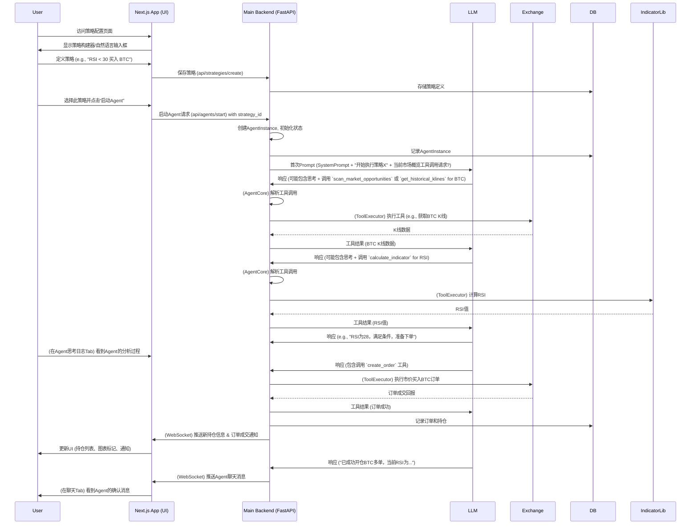
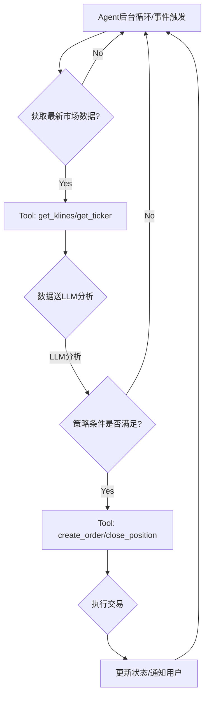

# AI 加密货币合约自动交易 Agent 策划文档

## 1. 引言

### 1.1 项目愿景

打造一个基于先进大语言模型 (LLM) Agent 技术的、用户友好的自动化**多资产**交易平台 (支持加密货币、股票、外汇等)，赋予用户定义和执行个性化交易策略的能力，实现新一代的“AI交易员”。

### 1.2 核心理念

其核心运作模式基于一种成熟的智能代理循环（Agentic Loop）思想，构建一个 AI Agent，该 Agent 能够：

* 理解用户通过自然语言或结构化界面定义的交易意图和策略。
* 通过调用一系列预定义的“交易工具”与外部环境（交易所API、行情数据源、技术指标库）交互。
* 基于 LLM 的推理能力，结合工具返回的信息和用户设定的策略，自主做出交易决策。
* 提供透明的决策过程展示和友好的人机交互界面。

### 1.3 目标用户

* 有一定交易经验（加密货币、股票、外汇等），希望将自己的交易思路自动化的交易者。
* 对 AI 技术在交易领域的应用感兴趣，并愿意尝试新工具的早期采用者。
* 希望从重复性的市场监控和手动执行中解放出来的活跃交易者。

### 1.4 文档目的

本文档旨在详细阐述该 AI 交易 Agent 平台的设计构想、功能模块、核心机制、技术架构考量以及未来发展方向，作为后续开发工作的指导蓝图。

## 2. 核心概念阐释

### 2.1 AI Agent (智能交易员)

一个由 LLM 驱动的软件实体，模拟人类交易员的思考和操作过程。它接收用户指令，理解市场信息，制定交易计划，并通过调用工具执行交易。

### 2.2 交易风格 (Trading Style / Trader Profile)

指 Agent 的高层次交易哲学、行为偏好或个性设定。它影响 Agent 的风险偏好、持仓周期、对市场波动的反应模式等。例如：“趋势猎手”、“日内精灵”。

### 2.3 交易策略 (Trading Strategy)

一套具体的、可操作的规则和条件集合，用于识别交易信号、执行入场、管理仓位和执行出场。例如：“RSI超买做空，1.5倍ATR止损，2倍ATR止盈”。

### 2.4 工具 (Tools)

Agent 与**各种交易市场及数据源**交互的接口。每个工具封装一项特定功能，如获取**不同资产类别**的行情、计算技术指标、执行**各类**订单等。LLM 决定调用哪个工具及相关参数，Agent 负责实际执行并返回结果。

### 2.5 系统提示 (System Prompt)

在每次与 LLM 交互时发送给 LLM 的固定指令集。它定义了 Agent 的角色、能力、可用工具列表、行为准则、当前交易风格和策略的核心要素等。

### 2.6 Agentic Loop (智能循环)

Agent 的核心工作流程：接收输入 -> LLM 思考与规划（可能决定调用工具）-> Agent 执行工具 -> 工具结果反馈给 LLM -> LLM 基于新信息再次思考 -> ... -> 最终决策与行动。

## 3. AI Agent 核心运行机制详解

本章详细描述 AI 交易 Agent 的内部工作原理，阐述其如何通过 Agentic Loop 实现基于 LLM 的智能决策和自动化交易。

### 3.1 Agentic Loop - 交易执行的核心循环

Agentic Loop 是一个持续的、由多个阶段组成的循环过程，驱动 Agent 完成任务。

* **3.1.1 触发器 (Triggers) - 循环的起点:**
  * **用户即时指令:** 用户通过聊天界面发出的直接命令或查询（例如：“帮我看看BTC现在的行情”，“ETHUSDT多单止损调整到2200”）。
  * **策略信号事件:** Agent 后台监控市场数据，当满足用户预设策略的特定条件时（例如，新K线形成且满足指标条件、价格突破关键水平），触发分析流程。
  * **定时任务:** 预设的周期性任务（例如，每个交易日开盘前获取市场宏观概览、每日收盘后总结当日交易表现）。
  * **内部状态变化:** Agent 自身状态的改变（例如，某个持仓达到预设的浮盈/浮亏比例）也可能触发进一步的评估。

* **3.1.2 阶段1: 输入处理与任务构建 (Input Processing & Task Formulation):**
  * Agent 接收到触发信号及其附带的初始数据（如用户输入的文本、最新的K线数据）。
  * Agent 核心逻辑（可能在LLM的初步辅助下）将这些输入转化为一个或多个内部可执行的任务或查询目标。例如，用户的自然语言指令“帮我分析下SOL最近的趋势”会被转化为一个目标为“分析SOL近期价格趋势并给出摘要”的任务。

* **3.1.3 阶段2: Prompt 构建 (Prompt Engineering):**
    这是与 LLM 有效沟通的关键。一个完整的 Prompt 通常由以下几部分构成：
  * **A. 系统提示 (System Prompt) - 基石:**
    * **Agent 角色定义:** 清晰定义 LLM 所扮演的角色，例如：“你是一个经验丰富且谨慎的**多资产市场（包括但不限于加密货币、股票、外汇等）**量化交易员AI助手。你的目标是根据用户设定的交易风格和策略，并利用提供的工具，来分析**各类市场**、识别交易机会并执行交易决策，同时最大化利润并控制风险。”
    * **核心能力与职责:** 阐述 Agent 应具备的能力（分析市场、执行策略、管理风险、与用户沟通等）和主要职责。
    * **可用工具列表及其详细使用规范:** 这是至关重要的一环。必须**极其详细和明确**地列出所有 Agent 可用的工具。对每个工具：
      * **名称 (Tool Name):** 如 `get_historical_klines`。
      * **功能描述 (Description):** 清晰说明工具的用途。
      * **调用格式 (Invocation Format):** 明确告知 LLM 应如何构造工具调用请求，强烈建议使用结构化格式如 XML 或特定JSON结构。例如：

                ```xml
                <tool_name>
                    <parameter_name_1>value1</parameter_name_1>
                    <parameter_name_2>value2</parameter_name_2>
                    ...
                </tool_name>
                ```

      * **参数 (Parameters):**
        * **必需参数 (Required):** 名称、数据类型、描述、示例值。
        * **可选参数 (Optional):** 名称、数据类型、描述、默认值（如有）、示例值。
      * **预期输出格式 (Expected Output Format):** 告知 LLM 工具成功执行后会返回什么样的数据结构（同样建议是结构化的，如XML或JSON），以及可能的错误格式。这有助于 LLM 理解工具结果并进行后续处理。
    * **当前交易风格与策略要点:** 动态注入当前用户激活的交易风格的关键原则（如风险偏好）和核心策略规则的摘要或引用。
    * **交互与输出指南:** 指导 LLM 如何与用户沟通（何时需要澄清、何时应主动汇报）、如何输出其思考过程（例如，使用 `<thinking>...</thinking>` 标签）、以及在何种情况下应调用 `attempt_completion` 或 `ask_user_clarification` 工具。
    * **行为约束:** 例如，禁止提供直接的财务建议、强调遵守风险管理规则等。
  * **B. 对话历史 (Conversation History):**
    * 包含用户与 Agent 之间之前的交互、Agent 的思考输出、工具调用及其结果。这为 LLM 提供了上下文。
    * 需要实现有效的上下文窗口管理策略（如滑动窗口、摘要等）以避免超出 LLM 的 token 限制。
  * **C. 当前任务/上下文输入 (Current Task/Contextual Input):**
    * 当前用户输入的指令文本。
    * 由触发器带来的最新市场数据（如新的K线数据）。
    * 上一个工具成功执行后返回的结构化结果。
    * Agent 维护的关于当前市场或持仓的内部“信念状态”的简报。

* **3.1.4 阶段3: 与 LLM 交互 (LLM Interaction):**
  * Agent 后端将上述构建好的完整 Prompt 发送给用户选定的 LLM 服务提供商的 API。
  * **强烈建议使用流式响应 (Streaming Response):** LLM 的输出是逐个 token 生成的。通过流式接收，可以实时地将 LLM 的思考过程和部分结果展示给用户（尤其是在“Agent思考日志”中），提升用户体验和透明度，而不是等待整个响应完成后再一次性处理。

* **3.1.5 阶段4: LLM 响应解析 (Response Parsing):**
    Agent 后端持续接收并解析来自 LLM 的流式响应。
  * **识别思考过程 (Chain-of-Thought / Inner Monologue):** 如果 System Prompt 指导 LLM 使用特定标签（如 `<thinking>...</thinking>` 或类似的XML/Markdown结构）来包裹其内部的分析和推理步骤，Agent 后端应能实时提取这部分内容。这些内容是“Agent思考日志”的主要来源。
  * **识别纯文本回复:** LLM 可能直接生成给用户的文本信息、分析摘要或问题。
  * **识别工具调用请求:** 这是核心。Agent 后端必须有一个健壮的解析器，能够从 LLM 的输出流中准确、无歧义地识别并提取结构化的工具调用指令。
    * 例如，如果约定使用XML格式，解析器会寻找 `<tool_name>...</tool_name>` 这样的完整结构块。
    * 一旦识别到工具调用块，立即提取工具的名称以及所有参数名和参数值。
    * **注意：** 在流式响应中，工具调用块可能是分多块到达的，解析器需要能处理这种情况，等待一个完整的工具调用结构出现后再进行处理。在LLM仍在输出工具参数时，不应过早中断或认为工具调用不完整。

* **3.1.6 阶段5: 工具执行 (Tool Execution):**
    一旦从 LLM 响应中成功解析出一个完整的工具调用请求：
  * **参数校验:** 在将参数传递给实际的工具执行逻辑前，Agent 后端必须对参数进行严格校验：
    * **类型检查:** 确保参数值符合工具定义的预期数据类型 (string, int, float, boolean, enum, array, object)。
    * **格式检查:** 例如，日期格式、交易对格式。
    * **范围/合理性检查:** 例如，数量不能为负，价格不能为零。
    * **权限检查 (如果适用):** 某些工具的某些参数组合可能需要特定用户权限。
    * 如果校验失败，应立即生成一个错误结果反馈给LLM，而不是尝试执行工具。
  * **(可选) 用户批准机制:** 对于某些高风险或用户配置为需要确认的工具（如首次大额下单），Agent 在此阶段会暂停，并通过UI（例如，弹窗或聊天消息内的按钮）向用户请求执行批准。用户可以批准、拒绝或提供修改意见。Agent 会等待用户响应后再继续。
  * **调用工具执行器:** Agent 后端调用内部注册的、与工具名称对应的具体函数或服务模块（即“工具执行器”）。
  * 工具执行器负责与外部系统（如交易所API、数据库、技术指标计算库）进行实际交互。

* **3.1.7 阶段6: 工具结果处理与反馈 (Tool Result Processing & Feedback):**
    工具执行完毕后，会返回一个结果，这个结果可能是成功的数据，也可能是执行过程中发生的错误信息。
  * **结果格式化:** Agent 后端将工具的原始输出（例如，从交易所API收到的JSON响应，或指标库计算出的数值）转换/包装成一个结构化的、LLM易于理解的文本格式。这个格式应与 System Prompt 中为该工具定义的“预期输出格式”相匹配。
    * **成功示例 (XML):**

            ```xml
            <tool_result tool_name="get_historical_klines">
                <status>success</status>
                <data>
                    <klines_data>
                        <kline timestamp="1672531200000" open="16500" high="16550" low="16480" close="16520" volume="120.5" />
                        <kline timestamp="1672534800000" open="16520" high="16580" low="16500" close="16570" volume="95.2" />
                        <!-- ... more klines ... -->
                    </klines_data>
                </data>
            </tool_result>
            ```

    * **失败示例 (XML):**

            ```xml
            <tool_result tool_name="create_order">
                <status>error</status>
                <error_details>
                    <exchange_error_code>-2010</exchange_error_code>
                    <message>Account has insufficient balance for requested action.</message>
                    <raw_exchange_response>{"code": -2010, "msg": "Account has insufficient balance for requested action."}</raw_exchange_response>
                </error_details>
            </tool_result>
            ```

  * **构造反馈消息:** 这个格式化后的工具结果将作为当前 Agentic Loop 周期的“输出”，并成为**下一轮循环开始时输入给 LLM 的“用户”消息的一部分**。它会被添加到对话历史的末尾。

* **3.1.8 阶段7: 循环或输出最终行动 (Loop or Final Action):**
    LLM 接收到包含工具执行结果的最新消息后，会再次进行思考和推理（即返回到本循环的阶段 3: 与LLM交互）。
  * **LLM 可能决定:**
    * **调用另一个工具:** 如果需要更多信息或执行序列中的下一步。
    * **向用户提问:** 如果信息不足或遇到歧义，LLM会调用 `ask_user_clarification` 工具。
    * **已获得足够信息，做出最终决策:** 例如，LLM分析完所有数据后，决定现在是开仓或平仓的时机，它会请求调用 `create_order` 或 `close_position` 工具。
    * **直接回复用户信息:** 如果用户的输入是一个查询，LLM可能会直接生成文本答案。
  * **最终行动:** 当LLM的决策导向一个外部世界的改变（如执行交易订单）或一个给用户的明确答复时，Agentic Loop 的当前迭代就可能接近尾声，或者根据策略逻辑，Agent会继续主动监控市场，开始新的循环。

### 3.2 Prompt 工程的关键考量

* **清晰性与明确性:** System Prompt 中对 Agent 角色、目标、工具的描述必须清晰无歧义。
* **工具的全面性与原子性:** 工具集应尽可能覆盖 Agent 可能需要执行的原子操作。过于复杂的工具会增加 LLM 的使用难度。
* **示例驱动:** 在 System Prompt 中为工具使用提供清晰的示例，能显著提升 LLM 的理解和遵循能力。
* **迭代优化:** Prompt 不是一成不变的，需要根据 Agent 的实际表现持续测试和优化。
* **策略与风格的注入:** 如何将用户定义的交易风格和复杂策略规则有效地分解并融入到 Prompt 中，让 LLM 能够理解并遵循，是一个核心挑战。可能需要将策略规则转化为 LLM 更易理解的逻辑描述或伪代码。

### 3.3 状态管理与数据库驱动的持续记忆 (State Management & Database-Driven Continuous Memory)

为了使 Agent 能够从历史经验中学习、适应市场变化，并提供更个性化和高效的交易决策，一个强大且完全基于结构化数据库的状态管理和持续记忆机制是核心。Agent的所有记忆，无论是短期的操作状态还是长期的经验教训，都将通过数据库进行统一管理和访问。

* **A. 短期记忆 (Contextual Memory / Working Memory):**
  * **定义:** 主要指 LLM 在处理当前任务或对话回合时，其上下文窗口 (context window) 内能直接访问的信息。
  * **内容:** 包括最近的对话历史（用户指令、Agent回复、工具调用及结果）、当前Prompt中的System Prompt片段、以及少量由Agent核心逻辑在短期内注入的上下文变量（如当前关注的交易对、最近一次计算的指标值、从数据库中刚检索到的与当前任务高度相关的数据片段）。
  * **特点:** 访问速度快，直接影响LLM的当前思考。但容量有限（受限于LLM的上下文窗口大小），且具有易失性（超出窗口后信息丢失或被压缩，需要依赖中期和长期记忆的再提取）。
  * **管理:** 需要有效的上下文窗口管理策略，如滑动窗口、信息摘要、token计数等，以确保最重要的信息保留在窗口内。Agent核心逻辑负责从中期/长期记忆（数据库）中选择性地加载最相关的信息片段到短期记忆中，供LLM使用。

* **B. 中期状态 (Operational State / Session Memory - 数据库支持):**
  * **定义:** Agent 实例在执行一个特定交易策略或与用户进行一次完整交互会话期间，需要跟踪和维护的关键运行参数和状态信息。**所有这些状态都将持久化到结构化数据库中。**
  * **内容 (示例，具体见第7章数据模型):**
    * 当前激活的交易风格ID和核心参数 (存储于 `AgentInstances` 与 `TraderProfiles` 关联)。
    * 当前激活的交易策略ID及其所有可调参数的当前值 (存储于 `AgentInstances` 与 `TradingStrategies` 关联)。
    * 策略执行进度：例如，当前策略处于哪个阶段，相关的条件满足情况等 (可设计专门的 `StrategyExecutionState` 表或在 `AgentInstances` 中用JSONB存储)。
    * 当前持仓的详细快照 (存储于 `Positions` 表, Agent定期与交易所同步并更新此表)。
    * 重要的市场观察或由LLM通过 `update_internal_belief_state` 工具记录的“信念”（这些文本可以直接存储在如 `AgentBeliefs` 或 `AgentActivityLogs` 表的TEXT字段中，并可通过关键词或元数据进行查询）。
    * 正在等待用户批准的挂起操作或等待用户回复的澄清问题 (可记录在 `AgentInstances` 的状态字段或专门的 `PendingActions` 表)。
    * 最近N次交易的简要结果和性能指标 (可从 `TradeOrders` 或 `TradeReflections` 表中查询得到)。
  * **特点:** 持久、可靠，与特定Agent实例的运行周期相关。由于存储在数据库中，即使服务重启或Agent实例暂停再恢复，也能完整恢复之前的状态。
  * **访问:** LLM通过指导Agent调用特定的数据库查询工具（见第6章核心工具集）来按需读取和（间接）更新这些中期状态。

* **C. 长期记忆 (Experiential & Learned Knowledge - 数据库驱动):**
    这是实现 Agent “学习”和“进化”的核心，使其能够从过去的成功和失败中吸取教训。**所有长期记忆都将存储在结构化数据库中，并通过LLM指导的精确查询和分析来利用。**
  * **C.1 交易反思机制 (Trade Reflection Mechanism):**
    * **触发:** 在每笔重要交易完成（尤其是平仓）后，Agent应自动或在LLM指导下触发一次“交易反思”流程。
    * **过程:** 通过调用增强版的 `self_reflect_on_last_trade` 工具，LLM被引导分析该笔交易的完整生命周期。
    * **反思内容 (全部存储于数据库，例如 `TradeReflections` 表):**
      * **结构化数据:** 交易ID、时间戳、交易对、方向、开/平仓价格、数量、盈亏结果、所用策略快照、关键指标值等。
      * **LLM生成的文本分析 (存储在TEXT字段):**
        * 决策依据：LLM对入场理由的详细阐述。
        * 出场依据：LLM对出场理由的详细阐述。
        * 市场状况回顾：LLM对交易期间市场状况的描述。
        * 成败归因分析：LLM对这笔交易为什么成功或为什么失败的深入分析。
        * 经验教训 (Lessons Learned): LLM从这次交易中总结出的、对未来有指导意义的具体经验或规则调整建议。
  * **C.2 记忆存储 (Memory Storage - 纯数据库方案):**
    * **所有反思数据均存入关系型数据库:**
      * `TradeReflections` 表（或类似命名的表）将包含所有结构化交易快照和参数，以及专门的TEXT或VARCHAR(MAX)类型的字段来存储LLM生成的上述所有文本分析内容（决策依据、出场依据、市场回顾、成败分析、经验教训）。
      * 不再需要独立的向量数据库来存储文本嵌入。
  * **C.3 记忆检索 (Memory Retrieval - 基于LLM指导的数据库查询):**
    * **触发时机:** 当 Agent 准备分析新的交易机会、评估当前策略步骤、或用户提出需要参考历史经验的问题时。
    * **检索方式:** LLM **不进行模糊的语义搜索**，而是通过其对数据库schema（通过`get_database_schema`工具获得）的理解，指导Agent调用数据库查询工具（如 `query_database` 或更具体的封装）来检索信息。
      * **LLM的指导示例（内部思考，然后生成工具调用参数）：**
                1. *"用户想知道在ETH震荡行情下使用MACD策略的历史表现。我需要查询 `TradeReflections` 表，筛选条件是 `pair`='ETH/USDT'，`strategy_name` 包含 'MACD'，并且 `market_conditions_summary` (文本字段) 包含关键词 '震荡' 或 'choppy' 或 'range-bound'。我需要返回这些交易的 `pnl_usd`、`lessons_learned` 和 `llm_analysis_and_lessons_learned` 字段，按时间倒序，取最近5条。"*
                2. Agent随后调用 `query_database` 工具，将这些条件作为参数传入。
      * **工具参数示例 (传递给 `query_database` 工具):**

                ```xml
                <query_database>
                    <target_table>TradeReflections</target_table>
                    <columns_to_select>trade_id, pnl_usd, lessons_learned_text, llm_full_analysis_text</columns_to_select>
                    <filter_conditions>
                        <condition field="pair" operator="equals" value="ETH/USDT"/>
                        <condition field="strategy_name_used" operator="contains" value="MACD"/>
                        <condition field="market_conditions_summary_text" operator="contains_any_keywords" value="震荡,choppy,range-bound"/>
                    </filter_conditions>
                    <sort_by field="trade_timestamp" order="desc"/>
                    <limit>5</limit>
                </query_database>
                ```

    * **输出:** 工具返回满足条件的结构化数据行，包括存储的文本反思。
  * **C.4 记忆应用 (Memory Application in Prompts):**
    * 检索到的相关结构化数据和文本反思将作为上下文信息，清晰地注入到发送给 LLM 的新 Prompt 中（例如，在 `<retrieved_database_records>...</retrieved_database_records>` 标签内）。
    * **LLM 指导:** System Prompt 中应指导 LLM 如何利用这些从数据库中精确查询到的历史记录。例如：“以下是从数据库中根据你的请求检索到的相关历史交易记录和反思。请仔细分析这些数据，特别是‘经验教训’和‘LLM分析’部分，并结合当前市场情况，说明这些历史记录如何影响你对当前机会的判断和接下来的行动建议。”
  * **C.5 价值与目标 (与之前类似，但实现方式不同):**
    * 通过精确查询和分析结构化的历史数据和LLM自身的文本反思，实现从经验中学习。
    * 强化成功模式，避免重复错误。
    * 提升决策质量，个性化Agent行为。
    * 为用户生成基于真实历史数据的洞察。

通过这种纯数据库驱动的三层记忆与状态管理机制，AI交易Agent将拥有一个强大、可查询、可审计的知识基础，使其决策更具依据并有望实现持续的智能进化。

通过上述详细的机制，AI 交易 Agent 能够模拟人类专家的思考决策过程，利用 LLM 的强大推理能力，并通过结构化的工具调用与复杂的金融市场环境进行可靠交互。

## 4. 系统架构

### 4.1 高层架构图

```mermaid
graph TD
    User[用户] -- HTTPS --> NextApp[Next.js Web 应用 (React UI + API Routes as BFF)]
    NextApp -- API Calls (from Client or API Routes) --> MainBackend[主后端服务 (Python - FastAPI)]
    
    MainBackend -- User/Config Mgmt --> DB[(数据库 PostgreSQL)]
    MainBackend -- LLM API Calls --> LLMProvider[LLM 服务提供商 (OpenAI/Anthropic/Google)]
    MainBackend -- Exchange API Calls --> Exchange[加密货币交易所 (Binance/OKX/Bybit)]
    MainBackend -- Real-time Data Handling --> WebSocketServer[WebSocket 服务 (由 FastAPI 提供)]
    
    AgentCore[Agent 核心逻辑] -- Runs In --> MainBackend
    AgentCore -- Uses --> ToolExecutor[工具执行器]
    ToolExecutor -- Interacts With --> Exchange
    ToolExecutor -- Calculates Indicators --> IndicatorLib[技术指标库]
    
    NextApp -- WebSocket Connection --> WebSocketServer
    TradingView[TradingView 轻量图表库] -- Embedded In --> NextApp

    subgraph "Next.js Application (Frontend & BFF)"
        direction LR
        ReactUI[React UI Components (SSR/CSR)]
        APIRoutes[API Routes (BFF)]
        ReactUI --> APIRoutes
        APIRoutes -.-> MainBackend
    end

    subgraph "Main Backend Services (Python - FastAPI)"
        AgentCore
        ToolExecutor
        UserAccountService[用户账户服务]
        ConfigService[配置管理服务]
        OrderMgmtService[订单管理服务]
        NotificationService[通知服务]
        WebSocketServer
    end
```

### 4.2 前端 Web 应用

* **技术选型:** Next.js (基于 **React 19**)。计划使用 **Magic UI** 等现代化 UI 组件库来构建界面。
* **主要职责:** 用户界面展示与交互、用户输入处理、通过其 API Routes (作为 BFF) 或直接与主后端 API 通信、实时数据显示 (通过 WebSocket 连接到主后端服务)、嵌入 TradingView 图表。
* **核心优势:** 利用 Next.js 进行服务端渲染 (SSR) 或静态站点生成 (SSG) 以优化首屏加载，API Routes 作为后端即服务 (BFF) 的潜力，文件系统路由的便捷性，React 19 的新特性，成熟的 React 组件模型。

### 4.2.1 Next.js 前端架构

* **目录结构:** 项目将遵循 Next.js 的标准目录结构，包括：
  * `pages`: 用于页面级路由、SSR/SSG 数据获取函数。
  * `app`: (如果采用 App Router 模式) 用于基于组件的路由和布局。
  * `components`: 存放可复用的 React UI 组件。
  * `lib` 或 `utils`: 存放辅助函数、工具类和客户端服务。
  * `public`: 存放静态资源如图片、favicon 等。
  * `pages/api`: Next.js API Routes，作为 BFF 层。
* **路由:** 采用 Next.js 基于文件系统的路由机制。
* **组件化设计:** 严格遵循 React 的组件化设计原则，利用 **Magic UI** 等库构建高内聚、低耦合、可复用、可维护的 UI 单元，以支持仪表盘的复杂布局和交互。
* **状态管理:**
  * **选型:** 针对 Vibetrade 应用的复杂性，优先考虑使用 **Zustand** 或 **Redux Toolkit** 作为全局状态管理方案。
    * **Zustand:** 轻量级、上手快，API 简洁，能有效管理全局状态而无需过多模板代码。
    * **Redux Toolkit:** 功能更全面，适合非常复杂的状态逻辑和中间件需求，但相对 Zustand 更重一些。
  * **理由:** 这些方案能提供中心化的状态存储，便于跨组件共享数据（如用户认证信息、全局配置、Agent 状态摘要等），并能与 Next.js 的数据获取和生命周期良好集成。
  * 局部组件状态将使用 React 内置的 `useState` 和 `useReducer`。
* **数据获取策略:**
  * **`getServerSideProps` (SSR):** 用于需要在请求时从后端（可能通过 BFF API Route）获取关键数据并进行服务端预渲染的页面，如仪表盘的主体框架或需要最新用户配置的页面，以提升首屏加载速度。
  * **`getStaticProps` (SSG):** 主要用于项目的静态内容页面，如产品介绍、FAQ、文档等（如果未来有这些页面）。
  * **客户端数据获取 (CSR):**
    * 对于高度动态的数据（如实时行情、持仓更新、Agent 聊天和日志流），将主要采用客户端数据获取。
    * 推荐使用 **SWR** 或 **React Query (TanStack Query)** 这类库来处理客户端的数据请求、缓存、重新验证和状态同步，它们能极大地简化数据管理逻辑，并提供乐观更新、轮询等高级功能。
    * 这些库将通过 Next.js API Routes (BFF) 或直接调用主后端 FastAPI 服务获取数据。
* **国际化 (i18n):** 计划使用 `next-i18next` (基于 `i18next`) 或社区推荐的适用于 React 19 的最佳 i18n 方案，实现多语言支持，确保界面文本和内容的本地化。

### 4.3 后端服务

* **技术选型:** Python (使用 FastAPI 框架)。选择 FastAPI 是因为它是一个现代、高性能的 Python Web 框架，非常适合构建 API 服务，并且拥有出色的异步支持（对于处理大量 I/O 密集型操作如外部 API 调用、数据库交互至关重要）和自动数据校验及文档生成功能。其生态系统与 Python 在 AI/LLM 和数据处理方面的优势能良好结合。
* **4.3.1 Agent 核心逻辑服务 (Agent Core) - 运行于 FastAPI 后端:**
  * 管理 Agent 实例的生命周期。
  * 实现 Agentic Loop。
  * 构建和管理发送给 LLM 的 Prompt (包括 System Prompt 和对话历史)。
  * 解析 LLM 的响应，识别工具调用请求。
  * 协调工具执行器执行工具。
  * 维护 Agent 的内部状态和短期记忆。
* **4.3.2 用户账户与配置管理服务:**
  * 用户注册、登录、认证。
  * 安全存储用户配置，包括交易所 API Key (高强度加密)、LLM API Key、选择的交易风格、自定义的交易策略等。
* **4.3.3 市场接口与交易执行模块:**
* 封装对各类交易市场接口（包括加密货币交易所、股票经纪商、外汇平台等）API的调用 (获取行情、下单、查询持仓/订单、资金操作等)。
* 处理不同市场接口的 API 错误、速率限制等。
* 尽可能标准化不同市场接口的调用方式。
* **4.3.4 LLM API 交互模块:**
  * 封装对不同 LLM 提供商 API 的调用。
  * 处理 API 错误和重试逻辑。
* **4.3.5 数据存储服务:**
  * 与数据库交互，持久化用户信息、配置、交易历史、Agent 日志等。
* **4.3.6 行情数据处理与指标计算服务:**
  * 可以订阅**不同市场（如交易所、数据提供商）**的实时行情数据 (WebSocket 或其他协议)。
  * 提供常用的技术指标计算功能 (可内置或调用库)。
* **4.3.7 WebSocket 服务 (集成于 FastAPI 后端):**
  * 将使用 FastAPI 内置的 WebSocket 支持或结合 `python-socketio` 等库，在主 Python 后端实现 WebSocket 服务。
  * 负责处理与客户端 (Next.js 前端) 的双向实时通信连接。
  * 向前端推送实时更新，如 Agent 状态、持仓变化、新交易信号、Agent 思考日志流等。
* **4.3.8 通知服务 (运行于 FastAPI 后端):**
  * 通过邮件、App内通知等方式向用户发送重要事件提醒。

* **4.3.9 API 国际化支持 (i18n):**
  * 后端 API 返回的错误消息、验证提示、状态文本等需要支持多语言。需要选择合适的 Python i18n 库（如 `python-i18n`, `fastapi-babel` 或类似 FastAPI 中间件方案）来管理和提供翻译文本。

### 4.4 数据库

* **技术选型:** PostgreSQL。其关系型特性、对事务的强大支持、以及处理结构化数据的能力非常适合存储 Vibetrade 的核心业务数据（用户、配置、交易历史、Agent 记忆等）。JSONB 字段类型也为存储半结构化数据（如策略参数、日志详情）提供了灵活性。
* **主要存储内容:** 见第 7 章数据模型 (已更新为 7. 数据模型)。

### 4.5 第三方服务集成

* **交易市场接口:**
  * **加密货币交易所:** Binance, OKX, Bybit 等主流（含合约）交易所。
  * **股票市场:** (示例) Interactive Brokers (IBKR), Alpaca, TD Ameritrade (需研究其 API 适用性)。
  * **外汇市场:** (示例) OANDA, Forex.com (需研究其 API 适用性)。
* **LLM 服务提供商:** OpenAI (GPT系列), Anthropic (Claude系列), Google (Gemini系列) 等。
* **TradingView:** 使用其 Lightweight Charts™ 或 Trading Platform 图表库嵌入 (需评估其对股票、外汇等多资产图表的支持程度)。

### 4.6 Next.js 应用的部署策略

* **构建与启动:**
  * 使用 `npm run build` (或 `yarn build`) 执行 `next build` 命令来构建生产优化版本的 Next.js 应用。
  * 使用 `npm run start` (或 `yarn start`) 执行 `next start` 命令来启动 Next.js 生产服务器。
  * **包管理器 (Package Manager):** 项目前端 (`frontend/`) 统一使用 `pnpm` 作为包管理器。所有依赖安装、脚本运行等操作均应通过 `pnpm` 执行 (例如 `pnpm install`, `pnpm run dev`)。
* **部署选项:**
* **服务器部署 (主要方式):**
  * Next.js 前端和 Python (FastAPI) 后端将作为独立服务通过 Docker 容器进行部署。
  * 可部署到主流云平台 (如 AWS ECS/EKS, Google Cloud Run/GKE, Azure Kubernetes Service) 或自建的 Kubernetes 集群/物理服务器。
  * 用户将通过配置的域名访问 Web 应用。
  * Vercel 是 Next.js 应用的优秀托管平台，可作为前端部署的一个优先选项。
* **本地化运行 (未来探索):**
  * 考虑未来提供将 Web 应用打包成本地可执行二进制文件的可能性（例如使用 Electron, Tauri 或类似技术）。
  * 这将允许用户在个人电脑上直接运行 Vibetrade 应用，通过 `localhost` 或类似的本地地址访问，无需依赖外部服务器（除必要的 LLM 和交易所 API 通信外）。
* **容器化部署 (Docker):**
  * 为前端和后端分别创建 Dockerfile，以便于构建、分发和运行。
* **其他 PaaS/Serverless 平台:** 仍可按需评估。
* **自托管 Node.js 服务器 (用于前端):** 仍是备选方案之一。
* **环境变量管理:**
  * 通过 `.env` 文件 (如 `.env.local`, `.env.production`) 管理不同环境的配置。
  * Next.js 支持在构建时和运行时注入环境变量，确保敏感信息（如 API 密钥、数据库连接字符串）的安全。
  * 部署平台通常也提供环境变量管理功能。
* **SSR/ISR 注意事项:**
  * 如果应用大量使用 SSR (Server-Side Rendering) 或 ISR (Incremental Static Regeneration)，部署时需要确保 Node.js 服务器环境能够处理这些请求。
  * Vercel 和类似的平台对这些特性有原生支持。自托管时需要确保服务器配置得当。
* **与主后端服务的协同部署:**
  * Next.js 前端/BFF 和 Python (FastAPI) 主后端是两个独立的服务，可以独立部署和扩展。
  * 在本地开发时，可以使用 Docker Compose 统一管理和启动所有服务（Next.js, FastAPI, PostgreSQL）。
  * 在生产环境中，它们将通过网络进行通信（例如，Next.js API Routes 或客户端直接调用部署在特定域名下的 FastAPI 服务）。

## 5. 功能模块详解

### 5.1 用户引导与初始配置 (Onboarding & Setup)

* **5.1.1 欢迎与引导流程:**
  * 简洁明了地介绍产品核心价值和功能。
  * 步骤式引导用户完成初始配置。
* **5.1.2 交易所选择与 API Key 配置:**
  * 下拉列表选择支持的**交易市场/经纪商**。
  * 根据所选市场，输入相应的 API Key, Secret Key, 或其他认证凭据。
  * **安全提示:**
    * 强调 API凭据的权限配置（例如，仅开启交易权限，关闭资金划转/提现权限，除非策略明确需要）。
    * 告知用户 API 凭据将被加密存储。
    * 链接到各市场/经纪商创建 API 凭据的教程。
  * API 凭据连通性测试。
* **5.1.3 LLM 模型选择与配置:**
  * 选择 LLM 提供商 (OpenAI, Anthropic, Google 等)。
  * 选择具体的模型 (e.g., GPT-4, Claude 3 Sonnet, Gemini Pro)。
  * 输入对应提供商的 API Key。
  * 可选高级参数配置 (如 temperature, top_p，但初期可简化)。
  * LLM API Key 连通性测试。
* **5.1.4 交易偏好设定 (初始交易员档案/风格选择):**
  * 提供几种预设的“交易员档案/风格”供用户选择，例如：
    * **稳健趋势派:** 风险偏好较低，追求稳定趋势。
    * **激进日内派:** 风险偏好较高，追求短线高频机会。
    * **自定义:** 允许用户后续进行更细致的调整。
  * 此选择会影响 Agent 的一些默认行为和参数。

### 5.2 用户主仪表盘 (Dashboard)

* **5.2.1 整体布局设计:**
  * 采用经典的三栏式布局或用户可自定义的模块化布局。
  * 清晰的信息层级和视觉引导。
* **5.2.2 左侧面板: 资产、仓位与订单管理**
  * **当前持仓 (Active Positions):**
    * 列表形式展示每个持仓的详细信息：交易对、方向（多/空）、数量/名义价值、开仓均价、标记价格/指数价格、未实现盈亏 (金额及百分比)、保证金、预估强平价、已设置的止损/止盈价格。
    * 快速操作按钮：一键市价平仓、修改止损/止盈。
  * **当前委托 (Open Orders):**
    * 列表展示所有未成交的限价单、止损单、止盈单。
    * 信息：交易对、方向、类型、价格、数量、状态。
    * 快速操作按钮：取消订单。
  * **交易历史 (Trade History):**
    * 可筛选日期范围。
    * 展示已完成的交易记录：成交时间、交易对、方向、开/平仓价格、数量、手续费、实现盈亏。
  * **资产概览 (Account Balance):**
    * 显示主要保证金资产（如 USDT）的总额、可用余额、已用保证金。
    * 账户整体盈亏统计 (日/周/月)。
* **5.2.3 中间面板: 市场行情图表**
  * **TradingView 图表嵌入:**
    * 使用 TradingView Lightweight Charts™ 或更高级的图表库。
    * 用户可选择交易对。
    * 支持常用时间周期切换 (1m, 5m, 15m, 1h, 4h, 1D)。
    * 可叠加常用技术指标 (MA, EMA, MACD, RSI, Bollinger Bands等)，指标参数可由用户调整或由 Agent 根据策略动态添加。
    * 在图表上标记 Agent 的开平仓点位。
* **5.2.4 右侧面板: AI Agent 交互与洞察**
  * **Tab 1: 与 Agent 对话 (Chat with Agent):**
    * 聊天输入框，用户可以通过自然语言向 Agent 发出指令、提问、调整策略参数等。
      * 例如：“帮我关注一下 BTC 的机会，如果1小时RSI低于25就提醒我。”
      * “把 ETHUSDT 多单的止盈提高到 2500。”
      * “现在市场情绪怎么样？”
      * “解释一下你为什么刚才开了那笔 SOL 的空单。”
    * 聊天记录窗口，显示用户与 Agent 的对话历史。Agent 的回复应简洁明了，关键信息突出显示。
    * Agent 对指令的理解确认、执行状态反馈、工具调用结果概要。
  * **Tab 2: Agent 思考日志 (Agent's Inner Monologue / Full Interaction Log):**
    * **目标:** 为用户提供最大限度的透明度，展示 Agent 在做出每个决策或执行每个动作背后的完整 LLM 交互和内部处理流程。**这不仅仅是摘要，而是尽可能原始的、带有时间戳的流式记录，旨在完整重现 Agent 的“所思所想”和“所作所为”的每一步。**
    * **展示内容应包括但不限于:**
      * **触发事件 (Trigger Event):** 清晰记录启动当前 Agent 活动的源头 (e.g., `[YYYY-MM-DD HH:MM:SS.mmm] User Command Received: "BTC what's new?"`, `[YYYY-MM-DD HH:MM:SS.mmm] Market Event Triggered: ETH/USDT 1h KLINE closed, initiating strategy 'ETH_RSI_Trend'.`)
      * **Agent 内部任务识别 (Task Identification):** (e.g., `[YYYY-MM-DD HH:MM:SS.mmm] Task Identified: Analyze BTC recent trend.`)
      * **构建的 Prompt 片段 (可选，用于调试):** (e.g., `[Time] Adding to LLM context: Latest 20 klines for BTC/USDT.`)
      * **发送给 LLM 的完整请求 (可选，超级详细模式):** 包括完整的 System Prompt (可折叠显示)、当前的对话历史和最新的用户/工具输入。
      * **LLM 流式响应 - 思考过程 (LLM Stream - Thinking Process):**
        * 如果 LLM 被引导（通过 System Prompt）输出其思考链（例如，使用 `<thinking>...</thinking>` 标签），这部分内容应**完整、实时地流式展示**。
        * 例如: `[YYYY-MM-DD HH:MM:SS.mmm] LLM Stream (Thinking): "User wants to know about BTC. My plan is: 1. Get recent klines for BTC/USDT. 2. Calculate key MAs and RSI. 3. Look for recent news (if news tool available). 4. Summarize findings."`
      * **LLM 流式响应 - 意图调用工具 (LLM Stream - Tool Invocation Intent):** 在 LLM 完整输出工具调用结构之前，如果能识别出其意图（例如，开始输出 `<tool_name>` 标签），可以标记。
      * **LLM 流式响应 - 完整工具调用结构 (LLM Stream - Parsed Tool Call):** 一旦 Agent 后端成功解析出 LLM 输出的完整、合法的工具调用指令，应清晰展示：
        * 例如: `[YYYY-MM-DD HH:MM:SS.mmm] LLM Parsed Tool Call: <get_historical_klines><pair>BTC/USDT</pair><interval>1h</interval><limit>100</limit></get_historical_klines>`
      * **工具参数校验结果 (Tool Parameter Validation):** (e.g., `[YYYY-MM-DD HH:MM:SS.mmm] Tool Call Validation (get_historical_klines): Parameters OK.`)
      * **(如果需要) 用户批准请求与结果 (User Approval Cycle):** (e.g., `[YYYY-MM-DD HH:MM:SS.mmm] Action Requires User Approval: create_order for 0.1 BTC. Sending request to UI.`, `[YYYY-MM-DD HH:MM:SS.mmm] User Approval Result: Approved.`)
      * **实际执行的工具与参数 (Actual Tool Execution):** (e.g., `[YYYY-MM-DD HH:MM:SS.mmm] Executing Tool: get_historical_klines with parameters: {"pair":"BTC/USDT", "interval":"1h", "limit":100}`)
      * **工具返回的原始结果 (Raw Tool Result - 摘要或可展开的完整版):**
        * 成功: `[YYYY-MM-DD HH:MM:SS.mmm] Tool Result (get_historical_klines): Success. Received 100 kline data points. [Click to view raw data]`
        * 失败: `[YYYY-MM-DD HH:MM:SS.mmm] Tool Result (create_order): Error. Code: -2010, Message: Insufficient balance. Raw Response: {"code": -2010, "msg": "Account has insufficient balance for requested action."} [Click to view full error details]`
      * **LLM 在收到工具结果后的进一步思考流 (LLM Stream - Post-Tool Thinking):** (e.g., `[YYYY-MM-DD HH:MM:SS.mmm] LLM Stream (Thinking): "Received kline data. Now, I need to calculate RSI(14) on this data..."`)
      * **LLM 流式响应 - 最终文本输出给用户 (LLM Stream - Text to User Chat):** 如果 LLM 直接回复用户，这部分文本也应流式展示。
      * **Agent 内部决策/状态更新记录 (Internal Agent Decision/State Update):** (e.g., `[YYYY-MM-DD HH:MM:SS.mmm] Internal State Update: 'BTC_1h_RSI' set to 28.5.`, `[YYYY-MM-DD HH:MM:SS.mmm] Agent Decision: Based on 'Strategy_Alpha_Entry_Rule_1' (RSI < 30), entry condition met for BTC/USDT long.`)
    * **UI 设计:**
      * 界面应支持日志的实时流式追加。
      * 提供暂停/继续日志流的功能。
      * 强大的搜索和筛选功能（按时间范围、工具名称、LLM思考/工具执行/用户交互等日志类型、关键词）。
      * 对于结构化数据（如JSON/XML工具结果、LLM请求体），提供格式化显示和折叠/展开功能。
      * 清晰的时间戳（精确到毫秒）和事件来源标记。
      * 允许用户复制日志条目。

### 5.3 AI Agent 核心功能与机制

* **5.3.1 自然语言指令理解 (NLU):**
  * LLM 负责将用户在聊天框输入的自然语言指令（如“寻找机会”、“调整止损”）或用户在策略配置中描述的自然语言规则，转化为可操作的意图和参数。
* **5.3.2 动态 Prompt 构建:**
  * Agent 根据当前上下文（用户最新指令、市场数据、持仓情况、选定的交易风格和策略规则）动态构建或更新发送给 LLM 的 Prompt。
  * `SYSTEM_PROMPT` 包含基础角色、能力、工具列表。
  * 对话历史 (`apiConversationHistory`) 包含用户与 Agent 的交互。
  * 最新的用户输入/工具结果作为当前回合的 `user` 消息。
  * 策略规则和风格偏好可以作为 `SYSTEM_PROMPT` 的一部分，或在特定任务时动态注入到用户消息中。
* **5.3.3 工具调用与执行:**
  * LLM 在其响应中以特定格式（如XML）指定要调用的工具及其参数。
  * Agent 后端解析此格式，调用相应的工具执行器。
  * 工具执行器与交易所API、指标库等交互。
  * 执行结果（成功数据或错误信息）返回给 Agent 核心。
* **5.3.4 决策制定 (LLM-driven):**
  * Agent 将工具执行结果反馈给 LLM。
  * LLM 基于这些新信息，结合其对策略的理解和市场分析能力，做出下一步决策（如开仓、平仓、等待、调用其他工具进一步分析等）。
* **5.3.5 状态管理与记忆:**
  * **短期记忆:** 当前对话上下文、最近的市场数据、正在执行的策略步骤等，主要通过 LLM 的上下文窗口和 Agent 内部变量维护。
  * **长期记忆 (可选高级功能):**
    * Agent 可以学习和总结过去的成功/失败交易经验。
    * 可以将关键的策略调整、市场观察等持久化存储，并在未来构建 Prompt 时参考。
    * 可能需要向量数据库进行相似性检索。
* **5.3.6 主动性与响应性:**
  * **响应性:** Agent 对用户的直接指令和提问做出回应。
  * **主动性:** 在没有用户直接干预时，Agent 根据预设的策略和市场监控，主动寻找交易机会并执行操作。这需要一个后台轮询或事件驱动的机制来触发 Agent 的分析循环。

### 5.4 交易策略与风格配置模块

* **5.4.1 “交易员档案/风格” (Trader Profile/Style) 配置:**
  * 用户界面允许选择预设风格或调整风格参数。
  * **可配置参数示例:**
    * **总体风险等级:** (低/中/高) 或一个数值系数 (0-1)。
    * **最大同时持仓数量:** 限制 Agent 同时操作的合约数量。
    * **单笔交易最大仓位比例:** (相对于总保证金)。
    * **默认止损类型/幅度:** (例如，固定百分比，ATR倍数)。
    * **偏好持仓周期:** (超短/短/中)。
    * **对新闻/事件的敏感度 (高级):** 是否允许 Agent 参考外部新闻情绪调整行为。
* **5.4.2 “交易策略” (Trading Strategy) 配置:**
  * **策略库:** 提供一些经过验证或常见的策略模板，用户可以直接选用或作为起点进行修改。
    * 例如：RSI震荡策略模板、均线交叉趋势策略模板、布林带突破策略模板。
  * **自然语言策略定义器:**
    * 核心功能！用户可以使用接近自然语言的方式描述自己的策略逻辑。
    * 例如（加密货币）：“当比特币15分钟K线的RSI指标上穿30时做多，同时要求MACD的快线在慢线上方。止损设置在入场价下方2%，当盈利达到风险的1.5倍时部分止盈一半仓位，剩余仓位追踪止损。”
    * 例如（股票）：“当 AAPL 股票日线图突破前高，并且交易量放大超过20日均量的1.5倍时买入。初始止损设置在突破点下方一个ATR。”
    * 例如（外汇）：“当 EUR/USD 4小时图形成看涨Pin Bar，且随机指标从超卖区向上时做多。目标盈利为入场点上方100点。”
    * Agent (LLM) 负责将此描述解析为内部可执行的规则和工具调用序列。
  * **结构化策略构建器 (UI辅助):**
    * 提供表单、下拉框、条件连接符 (AND/OR) 等UI元素，辅助用户构建策略规则，降低纯自然语言的模糊性。
    * **组件化设计:**
      * **触发器 (Triggers):** 市场事件 (如新K线形成)、时间事件 (如每小时)。
      * **入场条件 (Entry Conditions):**
        * 基于技术指标: `RSI(14, 1h) < 30`, `EMA(10, 4h) crosses_above EMA(20, 4h)`
        * 基于价格行为: `Price breaks_above PivotPoint(S1)`
        * 组合条件: `Condition1 AND (Condition2 OR Condition3)`
      * **出场条件 (Exit Conditions):**
        * **止损 (Stop Loss):** 固定点数/百分比、ATR倍数、基于前低/前高等。
        * **止盈 (Take Profit):** 固定点数/百分比、风险回报比 (e.g., RR=2)、基于前高/前高等。
        * **追踪止损 (Trailing Stop):** 按固定点数或百分比追踪。
        * **时间止损 (Time Stop):** 持仓超过一定时间后无条件退出。
        * **反向信号止损/反手 (Signal Reversal):** 出现与持仓方向相反的强力入场信号时。
      * **仓位管理 (Position Sizing):**
        * 固定数量 (e.g., 0.01 BTC)。
        * 固定名义价值 (e.g., 1000 USDT)。
        * 账户余额百分比 (e.g., 每次交易使用可用保证金的2%)。
        * 基于风险的仓位计算 (e.g., 确保单笔最大亏损不超过账户的1%)。
      * **交易标的选择逻辑 (Instrument/Symbol Selection Logic):**
        * 固定交易标的: 只交易用户指定的几个标的 (如 BTC/USDT, AAPL, EUR/USD)。
        * 动态扫描:
          * 如用户描述的：“监控**特定市场（如纳斯达克）**中24小时涨幅榜前5的**股票**，寻找符合策略A的做多机会。”
          * Agent 需要调用 `scan_market_opportunities` (含市场类型、筛选排序参数) 等工具。
  * **策略参数化:** 允许用户为策略中的关键数值（如RSI周期、均线长度、止损百分比）设置可调参数。
  * **策略启用/禁用开关。**
  * **策略回测接口 (高级功能 - V2.0+):**
    * 允许用户在历史数据上测试策略表现。
    * 输出关键性能指标：胜率、盈亏比、最大回撤、夏普比率等。
    * **挑战:** 实现准确且高效的回测引擎本身就是一个复杂的工程。

### 5.5 通知与提醒系统

* **配置项:** 用户可选择接收哪些类型的通知以及通过什么渠道接收 (站内信、邮件、浏览器推送、App推送 - 如果有App)。
* **通知类型:**
  * **交易执行:** 开仓成功、平仓成功 (止盈/止损/手动)、订单被拒绝。
  * **重要信号:** Agent 根据策略识别到强烈的交易机会（即使用户开启了全自动，也可选择接收此类“关注”信号）。
  * **风险警告:**
    * 持仓接近强平价格。
    * 账户保证金率过低。
    * API Key 即将过期或权限异常。
    * Agent 连续亏损达到预警阈值。
  * **系统消息:** 平台维护通知、新功能上线等。

## 6. 核心工具集 (Tools for the Trading Agent)

Agent 通过调用这些工具与外部交互。每个工具应有清晰的输入参数和输出格式。

### 6.1 市场数据类 (Market Data Tools)

* **`get_historical_klines`**
  * **描述:** 获取指定**交易标的**、时间周期、数量的历史K线数据。
  * **参数:** `symbol` (string, e.g., "BTC/USDT", "AAPL", "EUR/USD"), `market_type` (optional enum: "crypto", "stock", "forex", etc. - 根据实际支持的市场定义), `interval` (string, e.g., "1h", "4h", "1d"), `limit` (int, e.g., 200), `end_time` (optional long, unix timestamp ms, for pagination)
  * **输出:** K线数据数组 (每条K线包含: 开盘时间, 开盘价, 最高价, 最低价, 收盘价, 成交量, 收盘时间, 成交额等 - 需注意不同市场可能存在的细微差异)。
* **`get_current_ticker_info`**
  * **描述:** 获取一个或多个指定**交易标的**的最新行情摘要信息。
  * **参数:** `symbols` (array of strings or single string, e.g., ["BTC/USDT", "AAPL"]), `market_type` (optional enum).
  * **输出:** **交易标的**信息数组 (每个对象包含: 标的标识, 最新价, 24h最高/最低, 24h涨跌幅, 24h成交量/额 - 需注意不同市场指标的可用性)。
* **`get_order_book`**
  * **描述:** 获取指定**交易标的**的当前深度订单簿。
  * **参数:** `symbol` (string), `market_type` (optional enum), `limit` (optional int, e.g., 20, 返回买卖盘档位数)。
  * **输出:** 包含 `bids` (买盘) 和 `asks` (卖盘) 的数组，每档包含价格和数量。
* **`scan_market_opportunities`**
  * **描述:** 根据特定条件筛选不同市场上的**交易标的**。
  * **参数:**
    * `market_type` (enum: "crypto_futures", "crypto_spot", "stock", "forex", etc. - 必需，指定扫描的市场类型),
    * `sort_by` (enum: "24h_change_percent", "24h_volume", "market_cap" (如果适用), etc. - 需根据市场类型调整可用选项),
    * `sort_order` (enum: "asc", "desc"),
    * `limit` (int, 返回数量),
    * `min_volume_usd` (optional float, 最小24h成交额USD或等值),
    * `exchange_or_broker` (optional string, 指定扫描的交易所或经纪商，如果适用)
  * **输出:** 符合条件的**交易标的**列表及其关键筛选指标值。

### 6.2 技术指标计算类 (Technical Indicator Tools)

这些工具接收K线数据作为输入（通常是 `get_historical_klines` 的输出），计算并返回指标值。

* **`calculate_indicator`** (通用指标计算工具)
  * **描述:** 计算指定的技术指标。适用于从各种市场获取的K线数据。
  * **参数:**
    * `indicator_name` (enum: "RSI", "SMA", "EMA", "MACD", "BOLL", "ATR", "KDJ", "ICHIMOKU", etc.),
    * `klines_data` (array of kline objects, from `get_historical_klines` - 结构应保持一致性，即使数据源自不同市场),
    * `parameters` (object, 包含指标所需的参数，e.g., for RSI: `{"period": 14}`, for MACD: `{"fast_period": 12, "slow_period": 26, "signal_period": 9}`).
  * **输出:** 指标计算结果。格式取决于指标（通常为数值数组或包含多个数值数组的对象）：
    * RSI/SMA/EMA: 一个数值数组，对应每根K线（除开计算期不足的K线）。
    * MACD: 包含 `macd_line`, `signal_line`, `histogram` 三个数值数组的对象。
    * BOLL: 包含 `upper_band`, `middle_band`, `lower_band` 三个数值数组的对象。
    * ATR: 一个数值数组。

### 6.3 账户与订单类 (Account & Order Tools)

* **`get_account_balance`**
  * **描述:** 获取指定交易账户 (可能通过 `account_id` 或 `exchange_id` 区分) 的各资产余额和总体资产估值。
  * **参数:** `account_id` (optional string, 用于区分不同经纪商或市场的账户)。
  * **输出:** 包含各资产余额 (总额, 可用, 冻结) 的对象数组，以及账户总值 (以用户设定或账户基础货币计价)。
* **`get_open_positions`**
  * **描述:** 获取当前所有持仓的详细信息。
  * **参数:** `symbol` (optional string, 获取特定交易标的的持仓), `market_type` (optional enum)。
  * **输出:** 持仓对象数组 (每个对象包含: 交易标的, 方向, 持仓量/手数/股数, 开仓均价, 标记价/现价, 未实现盈亏, 保证金 (如适用), 杠杆 (如适用), 预估强平价 (如适用), 止损价, 止盈价等 - 字段需根据市场类型适配)。
* **`get_order_details`**
  * **描述:** 获取特定订单的详细信息。
  * **参数:** `order_id` (string), `symbol` (optional string), `market_type` (optional enum)。
  * **输出:** 订单详情对象 (字段需根据市场类型适配)。
* **`get_historical_orders`**
  * **描述:** 获取历史订单记录。
  * **参数:** `symbol` (optional string), `market_type` (optional enum), `status` (optional enum: "filled", "canceled", "all"), `limit` (optional int), `start_time` (optional long), `end_time` (optional long)。
  * **输出:** 历史订单对象数组 (字段需根据市场类型适配)。
* **`create_order`**
  * **描述:** 创建一个新订单，适用于不同市场。
  * **参数:**
    * `symbol` (string, e.g., "BTC/USDT", "AAPL", "EUR/USD"),
    * `market_type` (enum: "crypto_futures", "crypto_spot", "stock", "forex", etc. - 必需),
    * `side` (enum: "buy", "sell"),
    * `type` (enum: "market", "limit", "stop_market", "stop_limit", etc. - 根据市场类型调整可用选项),
    * `amount` (float, 交易数量 - 对于股票是股数，外汇是手数或基础货币单位，加密货币是币的数量或合约张数，需明确),
    * `price` (optional float, 仅限价单或条件限价单需要),
    * `stop_price` (optional float, 仅条件单需要),
    * `leverage` (optional int, 杠杆倍数，仅适用于杠杆市场),
    * `reduce_only` (optional boolean, 是否为只减仓订单，主要用于衍生品市场),
    * `time_in_force` (optional enum: "GTC", "IOC", "FOK", "DAY", "POST_ONLY" - 根据市场类型和交易所支持情况调整).
  * **输出:** 成功时返回订单ID和订单信息 (字段需根据市场类型适配)，失败时返回错误信息。
* **`cancel_order`**
  * **描述:** 取消一个未成交的订单。
  * **参数:** `order_id` (string), `symbol` (optional string), `market_type` (optional enum)。
  * **输出:** 成功/失败状态。
* **`cancel_all_orders`**
  * **描述:** 取消指定**交易标的**或所有**交易标的**的全部未成交订单。
  * **参数:** `symbol` (optional string), `market_type` (optional enum)。
  * **输出:** 成功/失败状态及取消的订单列表。
* **`close_position`**
  * **描述:** 市价平掉指定**交易标的**的现有仓位。
  * **参数:** `symbol` (string), `market_type` (optional enum), `side_to_close` (enum: "long", "short" - 根据持仓方向确定平仓操作)。
  * **输出:** 平仓订单的结果。
* **`modify_position_margin` (主要适用于杠杆市场)**
  * **描述:** 调整逐仓模式下仓位的保证金 (如加密货币合约)。
  * **参数:** `symbol` (string), `market_type` (enum, e.g., "crypto_futures"), `amount` (float, 正数为增加，负数为减少), `type` (enum: "add", "reduce").
  * **输出:** 成功/失败状态。
* **`set_position_leverage` (主要适用于杠杆市场)**
  * **描述:** 设置指定**交易标的**的杠杆倍数 (如加密货币合约)。
  * **参数:** `symbol` (string), `market_type` (enum, e.g., "crypto_futures"), `leverage` (int).
  * **输出:** 成功/失败状态。
* **`set_position_tp_sl`**
  * **描述:** 为现有持仓设置止盈止损。
  * **参数:** `symbol` (string), `market_type` (optional enum), `take_profit_price` (optional float), `stop_loss_price` (optional float), `tp_trigger_by` (optional enum: "mark_price", "last_price", "bid_price", "ask_price" - 根据市场调整), `sl_trigger_by` (optional enum: "mark_price", "last_price", "bid_price", "ask_price" - 根据市场调整).
  * **输出:** 成功/失败状态。

### 6.4 LLM 辅助与交互类 (LLM Assistance & Interaction Tools)

* **`ask_user_clarification`**
  * **描述:** 当 Agent (LLM) 对用户指令或当前情况有疑问时，通过此工具向用户提问并等待用户在聊天界面回复。
  * **参数:** `question_to_user` (string, 要问用户的问题), `suggested_replies` (optional array of strings, 提供给用户的快速回复选项)。
  * **输出:** 用户的回复文本。
* **`summarize_text_content` (高级)**
  * **描述:** 如果系统集成了外部信息源（如新闻API、研究报告），此工具可用于让 LLM 总结长文本内容。
  * **参数:** `text_to_summarize` (string), `desired_length` (optional enum: "short", "medium", "detailed").
  * **输出:** 总结后的文本。
* **`perform_sentiment_analysis` (高级)**
  * **描述:** 对一段文本（如新闻标题、社交媒体帖子）进行情绪分析。
  * **参数:** `text_for_analysis` (string).
  * **输出:** 情绪分析结果 (e.g., {"sentiment": "positive", "score": 0.85} or "neutral", "negative").

### 6.5 内部状态与日志类 (Internal State & Logging Tools - Agent 自身使用)

这些工具主要由 Agent 内部逻辑或 LLM 驱动的思考过程调用，用于记录信息、更新内部状态、以及利用已学习的记忆，不直接与外部市场API交互。

* **`update_internal_belief_state`**
  * **描述:** LLM 可以用此工具更新 Agent 对某个市场、币种、指标状态或策略执行阶段的“信念”或“当前认知快照”。这些信念可以被中期状态管理机制持久化。
  * **参数 (XML示例):**

        ```xml
        <update_internal_belief_state>
            <belief_key>SYMBOL_MARKET_TF_assessment</belief_key> <!-- e.g., BTC/USDT_CRYPTO_1h_trend, AAPL_STOCK_1d_momentum -->
            <new_value>{"trend": "upward_channel", "confidence": 0.75, "key_support": "16000", "key_resistance": "17500"}</new_value>
            <reasoning>EMA10 above EMA20, RSI bouncing from 40, volume profile shows accumulation.</reasoning>
        </update_internal_belief_state>
        ```

  * **输出 (XML示例):**

        ```xml
        <tool_result tool_name="update_internal_belief_state">
            <status>success</status>
            <message>Belief state 'BTC/USDT_1h_trend_assessment' updated.</message>
        </tool_result>
        ```

* **`log_agent_activity`**
  * **描述:** LLM 可以用此工具记录其重要的决策点、观察、不涉及交易的分析结论或执行的非交易动作。这些日志主要用于“Agent思考日志”的展示，增强透明度。
  * **参数 (XML示例):**

        ```xml
        <log_agent_activity>
            <log_message>Market volatility has significantly increased in the last hour for ETH/USDT (or specific stock/forex pair). Holding off on new entries for Strategy B for now.</log_message>
            <log_level>info</log_level> <!-- "info", "debug", "warning", "thought_process" -->
            <details_json>{"volatility_metric": 0.05, "previous_metric": 0.02}</details_json> <!-- Optional structured details -->
        </log_agent_activity>
        ```

  * **输出 (XML示例):**

        ```xml
        <tool_result tool_name="log_agent_activity">
            <status>success</status>
            <message>Activity logged.</message>
        </tool_result>
        ```

* **`self_reflect_on_last_trade` (核心记忆形成工具)**
  * **描述:** 在一笔重要交易（尤其是平仓后）完成后，LLM **必须**调用此工具。LLM被引导结合交易的完整生命周期（决策依据、执行过程、市场状况、最终结果）进行深入反思，生成结构化和非结构化的反思内容。这些内容是构建和丰富 Agent 长期经验记忆库（包括结构化数据库、向量数据库以及可能的本地知识文件）的关键输入。
  * **参数 (XML示例):**

        ```xml
        <self_reflect_on_last_trade>
            <trade_id>INTERNAL_TRADE_ID_XYZ123</trade_id> <!-- Internal unique ID for the trade across its lifecycle -->
            <instrument_details>
                <symbol>BTC/USDT</symbol>
                <market_type>crypto_futures</market_type>
                <!-- Add other relevant instrument identifiers if needed -->
            </instrument_details>
            <strategy_snapshot>
                <strategy_name>RSI_Bounce_15m</strategy_name>
                <parameters>{"rsi_period": 14, "rsi_buy_threshold": 30, "stop_loss_atr_multiplier": 1.5, "take_profit_rr_ratio": 2.0}</parameters>
            </strategy_snapshot>
            <decision_rationale_entry>RSI(14) on 15m chart for BTC/USDT (crypto_futures) dropped to 28.5, below threshold 30. Market was in a short-term consolidation range. Entered long.</decision_rationale_entry>
            <decision_rationale_exit>Position hit take profit target based on 2:1 risk/reward ratio.</decision_rationale_exit>
            <actual_outcome>{"pnl_currency": "USD", "pnl_value": 55.75, "pnl_percent": 2.5, "duration_minutes": 120}</actual_outcome>
            <market_conditions_summary>During the trade, BTC price initially dipped slightly then rallied. Overall market sentiment for crypto was neutral. No major news events impacting this specific asset.</market_conditions_summary>
            <llm_analysis_and_lessons_learned>This trade on BTC/USDT was successful due to good entry timing on RSI divergence. The 2:1 RR target was appropriate for this setup. Lesson: Confirm RSI signals with volume for higher probability. Consider partial take profit at 1.5R if volatility is high for this asset class.</llm_analysis_and_lessons_learned>
        </self_reflect_on_last_trade>
        ```

  * **输出 (XML示例):**

        ```xml
        <tool_result tool_name="self_reflect_on_last_trade">
            <status>success</status>
            <reflection_summary>
                <trade_id>ORDER_XYZ123_FILL_ABC</trade_id>
                <key_lesson_learned_1>Confirm RSI signals with volume.</key_lesson_learned_1>
                <key_lesson_learned_2>Consider partial TP at 1.5R in high volatility.</key_lesson_learned_2>
                <structured_reflection_data_storage_id>REF_ID_DB_123</structured_reflection_data_storage_id>
            </reflection_summary>
            <message>Trade reflection processed and inputs generated for long-term memory storage in the database.</message>
        </tool_result>
        ```

  * **后端处理:** 此工具的后端会将参数中的结构化信息以及LLM生成的文本分析 (`llm_analysis_and_lessons_learned`, `market_conditions_summary` 等) 全部准备好并存入关系型数据库的相应表中（例如 `TradeReflections` 表的TEXT类型字段）。所有记忆都通过数据库管理。

### 6.6 数据库交互工具 (Database Interaction Tools)

这些工具允许 LLM 了解数据库结构并从中精确提取所需信息，是 Agent 实现基于数据库的长期记忆和知识利用的核心。

* **`get_database_schema`**
  * **描述:** 获取数据库中一个或多个指定核心表（或所有核心可查询表）的结构、字段名称、字段数据类型以及最重要的——为LLM准备的字段详细描述。LLM应首先调用此工具来理解可查询的数据范围和结构，以便后续指导 `query_database` 工具。
  * **参数 (XML示例):**

        ```xml
        <get_database_schema>
            <!-- 可选: 指定要查询schema的表名。如果为空或不提供，则可能返回一组预定义的核心表的schema摘要，或提示用户指定。 -->
            <table_names>
                <name>TradeReflections</name>
                <name>AgentBeliefs</name>
                <name>TradingStrategies</name>
                <!--  根据需要添加更多表名  -->
            </table_names>
            <detail_level>full_description</detail_level> <!-- 可选: "summary" (仅表名和字段名) 或 "full_description" (包含LLM描述)。默认: "full_description" -->
        </get_database_schema>
        ```

  * **输出 (XML示例 - 成功):**

        ```xml
        <tool_result tool_name="get_database_schema">
            <status>success</status>
            <data>
                <database_schema>
                    <table name="TradeReflections">
                        <description_for_llm>存储历史交易的反思记录，包含结构化数据和LLM生成的文本分析，用于从过去的经验中学习和回顾。LLM可以通过query_database工具查询此表以获取特定交易的反思、经验教训或在相似市场条件下的历史表现。</description_for_llm>
                        <column name="reflection_id" type="UUID" primary_key="true">
                            <description_for_llm>反思记录的唯一标识符。</description_for_llm>
                        </column>
                        <column name="trade_id_fk" type="VARCHAR" foreign_key="TradeOrders.exchange_order_id">
                            <description_for_llm>关联到 'TradeOrders' 表的交易订单ID，用于追溯具体交易。</description_for_llm>
                        </column>
                        <column name="trade_timestamp_ms" type="BIGINT_TIMESTAMP_MS">
                            <description_for_llm>交易完成（通常指平仓）的时间戳，以毫秒为单位的Unix时间戳。</description_for_llm>
                        </column>
                        <column name="symbol" type="VARCHAR_交易标的">
                            <description_for_llm>交易的标的符号，例如 'BTC/USDT', 'AAPL', 'EUR/USD'。</description_for_llm>
                        </column>
                        <column name="market_type" type="VARCHAR_市场类型">
                            <description_for_llm>交易标的所属的市场类型，例如 'crypto_futures', 'stock', 'forex'。</description_for_llm>
                        </column>
                        <column name="pnl_usd" type="DECIMAL_USD">
                            <description_for_llm>该笔交易以美元计价的盈亏金额，正数表示盈利，负数表示亏损。</description_for_llm>
                        </column>
                        <column name="llm_generated_analysis_text" type="TEXT_LLM分析">
                            <description_for_llm>LLM对该笔交易的完整、详细的成败归因分析、市场状况回顾和从中学到的经验教训总结。这是非常重要的文本信息，用于未来的学习和决策参考。可以通过关键词进行模糊查询。</description_for_llm>
                        </column>
                        <column name="lessons_learned_summary_text" type="TEXT_经验总结">
                            <description_for_llm>从该交易中提炼出的核心经验教训的简短摘要文本，通常由LLM在完整分析后生成，便于快速回顾。可以通过关键词进行模糊查询。</description_for_llm>
                        </column>
                        <column name="market_conditions_snapshot_text" type="TEXT_市场快照">
                            <description_for_llm>LLM描述的、在交易发生时的关键市场状况快照（例如趋势、波动性、关键支撑阻力位、相关新闻摘要等）。可以通过关键词进行模糊查询。</description_for_llm>
                        </column>
                        <column name="strategy_params_snapshot_json" type="JSONB_策略参数">
                            <description_for_llm>执行该笔交易时所使用的策略及其关键参数的JSON格式快照，用于分析不同参数下的策略表现。</description_for_llm>
                        </column>
                        <!-- ... 其他可能的字段及其为LLM准备的描述 ... -->
                    </table>
                    <table name="AgentBeliefs">
                        <description_for_llm>存储Agent在特定时间点由LLM通过 'update_internal_belief_state' 工具记录的对市场、币种、指标状态或特定模式的“信念”、“观察笔记”或“当前认知”。这些记录帮助Agent跟踪其思考演变，并可在后续决策中被查询参考。</description_for_llm>
                        <column name="belief_id" type="UUID" primary_key="true">
                            <description_for_llm>信念记录的唯一标识符。</description_for_llm>
                        </column>
                        <column name="timestamp_ms" type="BIGINT_TIMESTAMP_MS">
                            <description_for_llm>该信念或观察形成时的时间戳，以毫秒为单位的Unix时间戳。</description_for_llm>
                        </column>
                        <column name="belief_key" type="VARCHAR_索引键">
                            <description_for_llm>对此信念进行分类或索引的键名，例如 'BTC/USDT_CRYPTO_1h_trend_outlook', 'AAPL_STOCK_Market_Sentiment', 'EUR/USD_FOREX_Volatility_Spike_Detected'。应包含标的和市场类型以便于后续精确查询。</description_for_llm>
                        </column>
                        <column name="belief_value_text" type="TEXT_信念内容">
                            <description_for_llm>LLM对该主题的具体信念内容、观察描述或分析结论。例如：“当前1小时图EMA(10)上穿EMA(20)，且成交量放大，短期看涨趋势形成初步信号。” 可以通过关键词进行模糊查询。</description_for_llm>
                        </column>
                        <column name="reasoning_text" type="TEXT_理由">
                            <description_for_llm>LLM形成此信念或观察的简要理由或依据，例如：“基于EMA交叉信号和成交量确认。” 可以通过关键词进行模糊查询。</description_for_llm>
                        </column>
                        <column name="confidence_score" type="FLOAT_0_1">
                            <description_for_llm>LLM对此信念或观察的置信度评分（0到1之间），可选字段。</description_for_llm>
                        </column>
                        <!-- ... 其他可能的字段及其为LLM准备的描述 ... -->
                    </table>
                    <!-- ... 其他核心可查询表的schema描述，如TradingStrategies, MarketDataSnapshots (如果设计了的话) ... -->
                </database_schema>
            </data>
        </tool_result>
        ```

* **`query_database`**
  * **描述:** 允许 LLM 通过指定表名、要选择的列、结构化的过滤条件、排序方式和数量限制，从数据库中精确提取所需数据。LLM 不直接编写 SQL，而是提供这些结构化参数，由后端安全地转换为数据库查询。这是 Agent 从其长期记忆（数据库）中获取具体信息以辅助当前决策的核心工具。
  * **参数 (XML示例):**

        ```xml
        <query_database>
            <target_table>TradeReflections</target_table>
            <columns_to_select> <!-- 要查询并返回的字段列表 -->
                <column>trade_timestamp_ms</column>
                <column>pair</column>
                <column>pnl_usd</column>
                <column>lessons_learned_summary_text</column>
                <column>llm_generated_analysis_text</column> <!-- LLM可能会要求这个长文本字段以进行更深入的分析 -->
            </columns_to_select>
            <filter_conditions operator="AND"> <!-- 多个condition之间的逻辑关系，可以是 "AND" 或 "OR" -->
                <condition field="symbol" operator="equals" value="ETH/USDT"/>
                <condition field="market_type" operator="equals" value="crypto_futures"/>
                <condition field="strategy_name_used" operator="contains" value="MACD_Crossover"/>
                <condition field="market_conditions_snapshot_text" operator="contains_any_keywords">
                    <keyword>震荡</keyword>
                    <keyword>choppy</keyword>
                    <keyword>range-bound</keyword>
                </condition>
                <condition field="trade_timestamp_ms" operator="greater_than_equals_ms_ago" value="2592000000"/>
            </filter_conditions>
            <sort_by>
                <column>trade_timestamp_ms</column>
                <order>desc</order>
            </sort_by>
            <limit>3</limit>
        </query_database>
        ```

  * **输出 (XML示例 - 成功):**

        ```xml
        <tool_result tool_name="query_database">
            <status>success</status>
            <query_details>
                <table_queried>TradeReflections</table_queried>
                <filters_applied_summary>symbol='ETH/USDT' AND market_type='crypto_futures' AND strategy_name_used CONTAINS 'MACD_Crossover' AND market_conditions CONTAINS ('震荡' OR 'choppy' OR 'range-bound') AND timestamp >= (NOW - 30 days)</filters_applied_summary>
                <rows_returned>3</rows_returned>
            </query_details>
            <data>
                <records>
                    <record>
                        <trade_timestamp_ms>1672876800000</trade_timestamp_ms>
                        <symbol>ETH/USDT</symbol>
                        <market_type>crypto_futures</market_type>
                        <pnl_usd>-15.20</pnl_usd>
                        <lessons_learned_summary_text>MACD crossover in choppy market needs volume confirmation. Wider stop might be needed.</lessons_learned_summary_text>
                        <llm_generated_analysis_text>The entry was based on MACD signal, but market lacked clear direction and was highly volatile, resulting in stop-loss hit. Future consideration: add a volatility filter (e.g., ATR percentage) or require stronger trend confirmation for this strategy in similar choppy conditions for this asset class. The stop loss at 1.5x ATR was insufficient for the observed whipsaws.</llm_generated_analysis_text>
                    </record>
                    <!-- ... 另外两条记录 ... -->
                </records>
            </data>
        </tool_result>
        ```

  * **支持的过滤操作符 (示例，需在后端实现):** `equals`, `not_equals`, `greater_than`, `less_than`, `greater_than_equals`, `less_than_equals`, `contains` (for text, case-insensitive), `not_contains` (for text), `starts_with` (for text), `ends_with` (for text), `in_list` (value is a comma-separated string or array), `not_in_list`, `is_null`, `is_not_null`, `contains_any_keywords` (for text search across multiple keywords with OR logic, case-insensitive), `contains_all_keywords` (for text search with AND logic, case-insensitive), `greater_than_equals_ms_ago` (value is milliseconds, compares against NOW - value), `less_than_equals_ms_ago` (value is milliseconds).
  * **后端处理:** 工具后端将这些结构化参数安全地转换为参数化的SQL查询（或ORM操作），执行查询并返回结果。必须采取一切措施防止SQL注入，例如严格校验输入、使用参数化查询、限制可查询的表和字段等。

## 7. 数据模型 (Database Schema)

### 7.1 `Users`

* `user_id` (PK, UUID/INT)
* `username` (VARCHAR, UNIQUE)
* `email` (VARCHAR, UNIQUE)
* `password_hash` (VARCHAR)
* `created_at` (TIMESTAMP)
* `updated_at` (TIMESTAMP)

### 7.2 `ExchangeAPIKeys`

* `api_key_id` (PK, UUID/INT)
* `user_id` (FK to Users)
* `exchange_name` (VARCHAR, e.g., "Binance", "OKX")
* `api_key` (VARCHAR, Encrypted)
* `secret_key` (VARCHAR, Encrypted)
* `passphrase` (optional VARCHAR, Encrypted, for some exchanges)
* `permissions` (TEXT, e.g., "read_info,trade")
* `is_active` (BOOLEAN, DEFAULT TRUE)
* `created_at` (TIMESTAMP)
* `last_tested_at` (TIMESTAMP)

### 7.3 `LLMProviderConfigs`

* `llm_config_id` (PK, UUID/INT)
* `user_id` (FK to Users)
* `provider_name` (VARCHAR, e.g., "OpenAI", "Anthropic")
* `model_name` (VARCHAR, e.g., "gpt-4-turbo", "claude-3-sonnet")
* `api_key` (VARCHAR, Encrypted)
* `base_url` (optional VARCHAR, for custom endpoints)
* `is_active` (BOOLEAN, DEFAULT TRUE)
* `created_at` (TIMESTAMP)

### 7.4 `TraderProfiles` (交易风格/档案)

* `profile_id` (PK, UUID/INT)
* `user_id` (FK to Users)
* `profile_name` (VARCHAR, e.g., "我的激进日内风格", "稳健趋势跟随")
* `is_preset` (BOOLEAN, 是否为系统预设)
* `description` (TEXT, 风格描述)
* `risk_level` (ENUM/INT, e.g., 1-5 or 'low', 'medium', 'high')
* `max_concurrent_positions` (INT)
* `default_position_size_percent` (FLOAT, 占账户余额百分比)
* `default_stop_loss_type` (ENUM, e.g., 'percentage', 'atr')
* `default_stop_loss_value` (FLOAT)
* `preferred_holding_period` (ENUM, e.g., 'scalp', 'intraday', 'swing')
* `custom_parameters` (JSONB, 其他自定义风格参数)
* `created_at` (TIMESTAMP)
* `updated_at` (TIMESTAMP)

### 7.5 `TradingStrategies`

* `strategy_id` (PK, UUID/INT)
* `user_id` (FK to Users)
* `profile_id` (optional FK to TraderProfiles, 如果策略与特定风格关联)
* `strategy_name` (VARCHAR)
* `description_natural_language` (TEXT, 用户用自然语言描述的策略)
* `rules_structured` (JSONB, 结构化的规则表示，例如由UI构建器生成或LLM解析NL后转换)
  * `entry_conditions`: [{ `indicator`, `params`, `operator`, `value`, `timeframe` }, `logic_operator` ('AND'/'OR')]
  * `exit_conditions_sl`: { `type`, `value` }
  * `exit_conditions_tp`: { `type`, `value`, `rr_ratio` }
  * `position_sizing`: { `type`, `value` }
  * `target_pairs`: (array of strings or "dynamic_scan_rules")
* `is_active` (BOOLEAN, DEFAULT FALSE)
* `system_prompt_fragment` (TEXT, 此策略相关的特定Prompt片段，用于增强主System Prompt)
* `created_at` (TIMESTAMP)
* `updated_at` (TIMESTAMP)

### 7.6 `AgentInstances` (运行中的Agent实例)

* `instance_id` (PK, UUID)
* `user_id` (FK to Users)
* `active_profile_id` (FK to TraderProfiles)
* `active_strategy_id` (FK to TradingStrategies)
* `active_exchange_api_key_id` (FK to ExchangeAPIKeys)
* `active_llm_config_id` (FK to LLMProviderConfigs)
* `status` (ENUM: 'running', 'paused', 'stopped', 'error')
* `current_short_term_memory` (JSONB, Agent的上下文、LLM对话历史片段等)
* `last_heartbeat_at` (TIMESTAMP)
* `started_at` (TIMESTAMP)
* `stopped_at` (optional TIMESTAMP)

### 7.7 `Positions` (当前持仓 - 由Agent管理)

* `position_id_internal` (PK, UUID)
* `instance_id` (FK to AgentInstances)
* `exchange_position_id` (VARCHAR, 交易所返回的仓位ID，如果适用)
* `pair` (VARCHAR)
* `side` (ENUM: 'long', 'short')
* `entry_price` (DECIMAL)
* `quantity` (DECIMAL)
* `current_mark_price` (DECIMAL)
* `unrealized_pnl` (DECIMAL)
* `leverage` (INT)
* `initial_margin` (DECIMAL)
* `liquidation_price` (DECIMAL)
* `stop_loss_price_agent` (DECIMAL, Agent设定的SL)
* `take_profit_price_agent` (DECIMAL, Agent设定的TP)
* `opened_at` (TIMESTAMP, by Agent)
* `updated_at` (TIMESTAMP)
* `strategy_snapshot` (JSONB, 开仓时策略的关键参数快照)

### 7.8 `TradeOrders` (Agent执行的订单)

* `order_id_internal` (PK, UUID)
* `instance_id` (FK to AgentInstances)
* `position_id_internal` (optional FK to Positions, 如果是平仓单或与特定仓位关联)
* `exchange_order_id` (VARCHAR, 交易所返回的订单ID)
* `pair` (VARCHAR)
* `side` (ENUM: 'buy', 'sell')
* `type` (ENUM: 'market', 'limit', etc.)
* `status` (ENUM: 'new', 'partially_filled', 'filled', 'canceled', 'rejected', 'expired')
* `price` (DECIMAL, 触发价或限价)
* `quantity_ordered` (DECIMAL)
* `quantity_filled` (DECIMAL)
* `average_fill_price` (DECIMAL)
* `fee_amount` (DECIMAL)
* `fee_currency` (VARCHAR)
* `created_at_agent` (TIMESTAMP, Agent发起时间)
* `updated_at_exchange` (TIMESTAMP, 交易所最后更新时间)
* `reason` (TEXT, e.g., "Entry signal from Strategy X", "Stop loss triggered")

### 7.9 `AgentActivityLogs`

* `log_id` (PK, BIGSERIAL)
* `instance_id` (FK to AgentInstances)
* `timestamp` (TIMESTAMP)
* `log_level` (ENUM: 'info', 'debug', 'warning', 'error', 'thought_process')
* `message` (TEXT)
* `details` (JSONB, 可选的结构化日志详情，如工具调用参数和结果)

## 8. 用户交互流程 (示例)

### 8.1 用户配置新策略并启动 Agent



### 8.2 Agent 主动监控与执行 (简化)



## 9. 风险管理与安全性

### 9.1 API Key 安全

* **存储:** 所有用户API Key 和 Secret Key 在数据库中必须使用强加密算法 (如 AES-256-GCM) 进行加密存储，加密密钥本身需要妥善管理 (如使用 HSM 或云服务商的 KMS)。
* **传输:** 前后端传输API Key时必须使用 HTTPS。
* **使用:** 后端服务在调用交易所API前解密，尽量减少密钥在内存中的停留时间。
* **权限:** 强烈建议并引导用户在交易所创建 API Key 时，仅授予必要的权限（通常是“读取信息”和“允许交易”），**绝对禁止“允许提现”权限**。平台应在UI上明确提示这一点。
* **IP绑定 (可选):** 如果交易所支持，建议用户将其API Key绑定到平台的服务器IP地址。

### 9.2 Agent 行为控制与防护

* **硬编码限制:**
  * **最大单笔订单名义价值上限:** 防止意外下出巨额订单。
  * **最大持仓名义价值上限:** 控制总体风险暴露。
  * **每日/每周最大允许亏损额度 (全局或按策略):** 达到则暂停该Agent或策略。
  * **每日最大交易次数上限:** 防止高频失控。
  * **价格滑点保护:** 市价单成交价与预期价差异过大时取消或报警。
* **用户可配置的风险参数:** (在“交易风格/档案”中配置)
  * 例如：单笔亏损占账户总额百分比上限。
* **“紧急停止”按钮:** 用户可以一键暂停所有Agent活动，并可选市价平掉所有由Agent管理的仓位。
* **“只减仓”模式:** 在特定情况下（如用户手动干预后），Agent只能执行减少现有仓位的操作。
* **心跳检测:** Agent实例需要定期向主服务报告状态，长时间无心跳则自动暂停并通知用户。

### 9.3 LLM “幻觉”与不可靠性缓解

* **严格的工具输入/输出校验:** Agent在执行工具前，对LLM提供的参数进行格式和合理性校验。对工具返回给LLM的数据也要进行清洗和格式化。
* **明确的工具功能边界:** `SYSTEM_PROMPT` 中清晰定义每个工具能做什么，不能做什么。
* **关键决策的用户确认选项:** 对于高风险操作（如首次大额建仓、策略重大调整），可以设计一个用户可配置的“需要我批准”的选项。
* **限制LLM的直接交易执行权:** LLM的职责是分析和决策“调用哪个工具”，实际的订单执行由后端代码严格按照工具参数进行，不给LLM直接拼接API请求的机会。
* **冗余与重试:** 对于交易所API调用失败或超时，应有合理的重试机制。
* **监控与日志:** 详细记录LLM的思考过程、工具调用、执行结果，便于事后分析和问题排查。

### 9.4 用户教育与风险提示

* 在用户注册和首次使用时，必须有清晰、显著的风险提示，告知用户自动化交易的固有风险，历史业绩不代表未来表现，用户需对自己的资金负责。
* 提供关于策略配置、风险参数设置的教程和最佳实践建议。
* 不提供任何形式的投资建议。平台只提供工具。

## 10. 技术栈建议 (高层次总结)

* **前端 (Frontend & BFF):** Next.js (基于 **React 19**, 采用 **Magic UI** 等现代化组件库, 包含 API Routes 作为 BFF 层)。
  * **国际化 (i18n):** 使用 `next-i18next` (或类似适用于 React 19 的方案)。
* **主后端服务 (Main Backend Services):** Python (使用 FastAPI 框架), SQLAlchemy (ORM)。
  * **国际化 (i18n):** API 响应需支持多语言 (如使用 `python-i18n` 或 `fastapi-babel`)。
* **数据库 (Database):** PostgreSQL - 成熟的关系型数据库，支持事务，JSONB 类型可灵活存储半结构化数据，适合作为核心业务数据存储。
* **实时通信 (Real-time Communication):** WebSockets - 在 FastAPI 主后端服务中实现，用于与 Next.js 前端进行高效的双向实时数据交换（如行情、Agent状态、日志流）。
* **消息队列 (可选，用于解耦和异步任务处理):** RabbitMQ, Kafka, Redis Streams。
* **图表库:** TradingView Lightweight Charts™ / Trading Platform (需评估多资产类别适用性，以支持股票、外汇等市场)。
* **部署:**
  * **主要方式:** Docker 容器化部署前后端服务至云平台或自建服务器，通过域名访问 (Vercel 是 Next.js 前端的优秀选项)。
  * **未来探索:** 本地化运行 (打包成二进制文件，如 Electron/Tauri)。
* **监控:** Prometheus, Grafana, Sentry。

## 11. 未来展望与迭代计划

### V1.0 (MVP - Minimum Viable Product)

* **核心功能:**
  * 用户注册、登录。
  * 支持1-2个主流交易所的合约交易。
  * 支持1-2个主流LLM提供商。
  * API Key配置与安全存储。
  * 预设几种交易风格。
  * 通过自然语言（简化版）或结构化UI定义核心交易策略（RSI、均线等基础指标的条件组合，止损止盈）。
  * Agent能够根据配置的策略进行基本的自动化交易（开仓、平仓、止损/止盈）。
  * 主仪表盘展示：当前持仓、交易历史、TradingView图表嵌入。
  * 与Agent的简单聊天交互（查询持仓、手动平仓指令）。
  * 基本的风险控制（最大仓位）。
  * 核心工具集实现 (`get_klines`, `get_ticker_info`, `calculate_indicator` (RSI/MA), `get_balance`, `get_positions`, `create_order`, `close_position`, `set_tp_sl`)。
* **目标:** 验证核心Agentic Loop在真实交易环境下的可行性，收集早期用户反馈。

### V1.x (迭代改进)

* **增强策略定义:**
  * 更丰富的技术指标支持。
  * 更灵活的条件组合逻辑 (AND/OR/NOT)。
  * 更完善的仓位管理选项。
  * 动态币种扫描与选择逻辑。
  * Agent“思考日志”功能。
* **增强用户体验:**
  * 更美观和易用的UI。
  * 更详细的交易分析报告。
  * 更智能的Agent聊天交互。
* **增强风险管理:**
  * 用户可配置的全局和策略级风险参数。
  * “紧急停止”功能。
* **扩展支持:**
  * 支持更多交易所和LLM模型。
* **通知系统:** 实现邮件/站内核心事件通知。

### V2.0 (高级功能)

* **策略回测引擎:** 允许用户在历史数据上测试和优化策略。
* **Agent 学习与进化 (核心迭代方向 - 基于数据库的持久化记忆):**
  * **基于交易反思的参数自适应:** Agent（或后台分析模块）定期分析数据库中 `TradeReflections` 表的数据（包括结构化结果和LLM生成的经验教训文本），识别特定策略在不同市场条件下（可从反思的市场状况回顾文本中提取或结构化存储的特征）参数的最优范围。系统可向用户提示这些发现，或在用户允许的情况下，让Agent在后续交易中通过修改其在数据库中的策略参数配置来进行微调（例如，动态调整止损的ATR倍数、RSI的超买超卖阈值等）。
  * **高胜率模式识别与固化:** 通过对数据库中大量成功交易反思和相关记忆的统计与模式分析（例如，LLM可以通过 `query_database` 工具提取大量历史数据并进行分析），系统可以尝试识别特定币种、特定市场结构下的高胜率交易模式。这些识别出的模式、规则或特征可以被结构化地总结并存储回数据库的专门表格中（例如，一个名为 `LearnedTradingPatterns` 或 `KnowledgeBaseEntries` 的表，包含模式描述、适用条件、预期效果等字段），供Agent在未来决策时通过精确查询优先参考，或作为用户构建新策略模板的基础。
  * **用户反馈驱动的记忆增强:** 允许用户对Agent的交易决策、`TradeReflections` 中LLM生成的反思质量、以及从数据库中检索到的“经验教训”的有效性进行评分或提供文字反馈。这些反馈可以被用来：
    * 作为LLM在指导数据库查询以检索“相关经验”时的额外参考权重或过滤条件（例如，优先参考用户评价较高的历史反思）。
    * 作为LLM在进行下一次 `self_reflect_on_last_trade` 时的额外输入上下文，以生成更符合用户期望和实际交易效果的反思文本，并更新到数据库的 `TradeReflections` 表中。
    * 帮助识别和修正Agent认知模型中的潜在偏差，例如，通过分析用户持续负面反馈的交易类型，引导LLM在未来避免类似决策。
  * **策略建议引擎:** 基于对用户（匿名化和聚合后，如果涉及共享，或仅针对单个用户）存储在数据库中的历史交易数据和交易反思的分析，系统可以主动向用户提供策略优化建议、新策略思路，或提示当前激活策略在近期市场上的潜在风险/机会。例如，通过UI提示：“数据库分析显示，您在ETH上使用的趋势策略近期在震荡行情中止损较为频繁（过去X笔交易中Y笔因此止损，平均亏损Z）。历史反思记录表明，在类似行情下，降低仓位或引入区间交易策略（如策略模板C，其历史表现可在数据库中查询）可能效果更佳。是否需要Agent为您分析并配置一个基于当前市场状况的备选策略，并将新策略配置存入数据库？”
  * **（远期）引入更高级学习机制:** 在上述数据库驱动的经验积累和分析基础上，可进一步探索引入在线学习、强化学习等机制，使Agent能够在模拟或真实环境中通过与市场的持续交互来迭代优化其存储在数据库中的决策模型参数或规则集，但这需要非常谨慎的风险控制和评估框架。
* **更高级的自然语言理解与生成:** Agent能够进行更复杂的对话和市场分析阐述。
* **组合策略/多Agent协同:** 允许用户运行多个Agent实例，或将多个简单策略组合成复杂策略。
* **社区与策略市场 (远期):** 用户可以分享（或付费订阅）交易策略。
* **移动端App。**

## 12. 总结

基于LLM Agent的自动交易系统是一个充满潜力但也极具挑战性的方向。通过精心的Agent设计思想，将LLM的强大理解和推理能力与结构化的工具调用相结合，有望创造出真正智能且用户可控的交易解决方案。成功的关键在于严谨的系统设计、强大的风险控制、友好的用户体验以及持续的迭代优化。

---
*本文档为 vibetrade 项目的技术规格和设计蓝图。*
